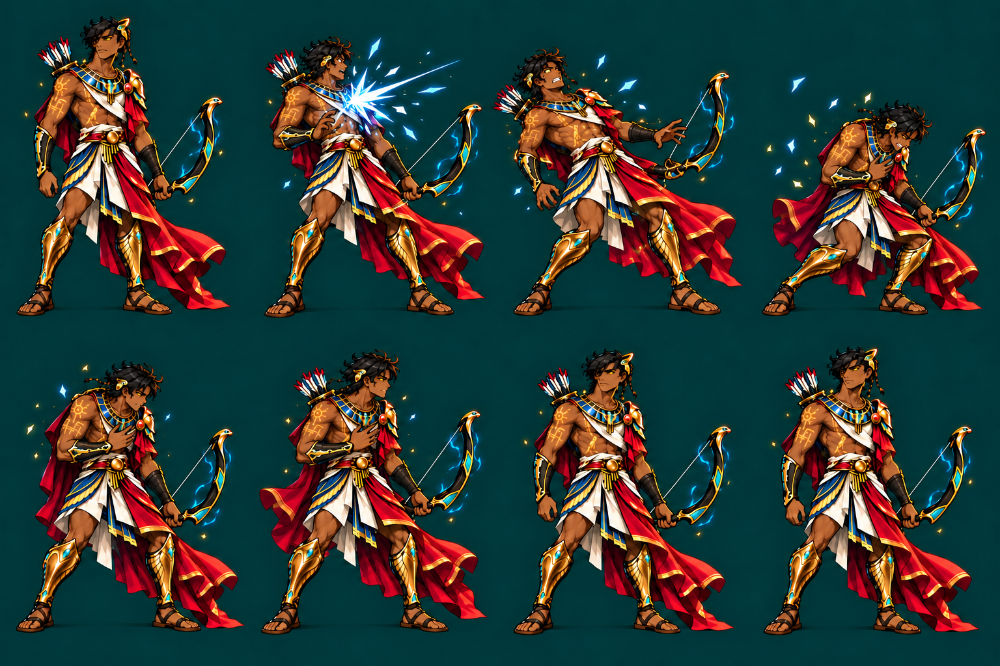
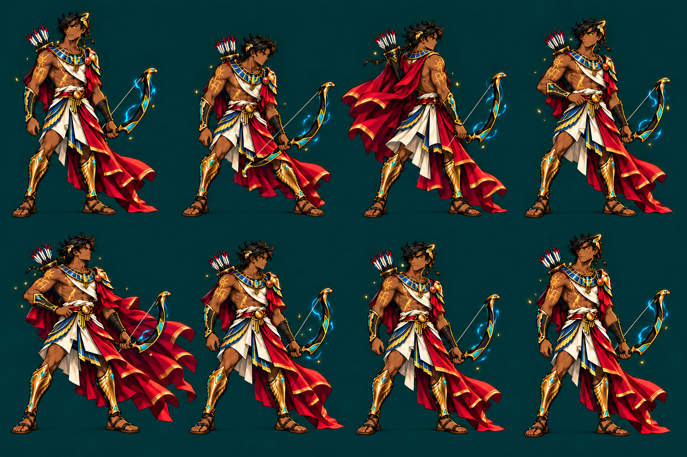
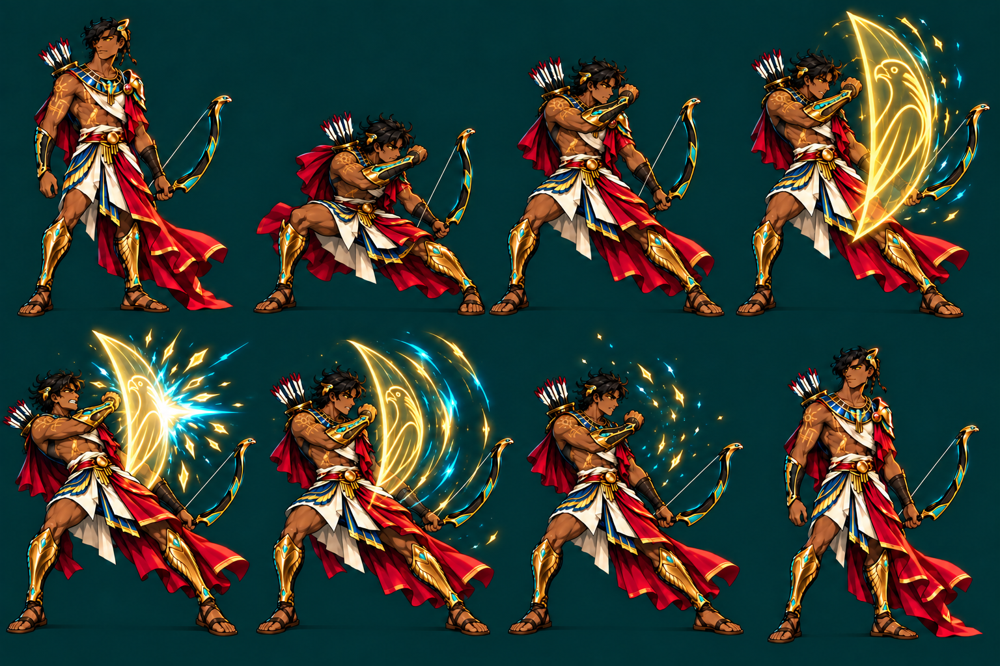
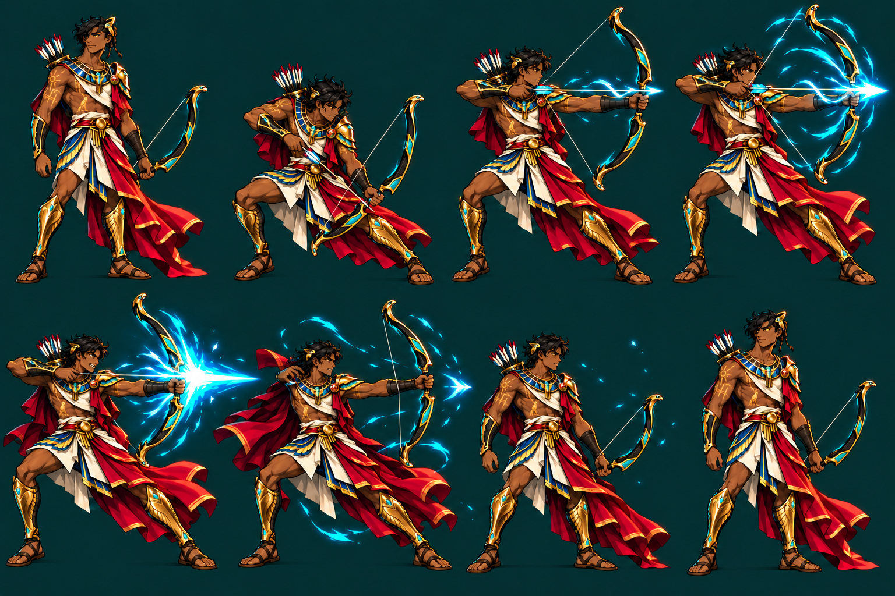

# Egyptian Archer — Expressive Animation Studies

These sprite sheets explore a more exaggerated, readable combat style for the Egyptian demigod archer. Each sheet is a **4 × 2 grid** read left-to-right, then top-to-bottom.

| Action | Sprite sheet | Visual intent |
|---|---|---|
| Attack charge | [archer_attack_charge_sheet.png](./archer_attack_charge_sheet.png) | Blue energy builds around the drawn arrow, followed by a strong release trail and recoil. |
| Idle | [archer_idle_sheet.png](./archer_idle_sheet.png) | Visible breathing, weight shifts, moving cloth, and a subtle blue bow aura. |
| Block | [archer_block_sheet.png](./archer_block_sheet.png) | A low defensive brace, bright falcon-shaped guard impact, and forceful rebound. |
| Take damage | [archer_take_damage_sheet.png](./archer_take_damage_sheet.png) | A clear blue-white hit flash, sharp recoil, and readable recovery. |

## Preview

### Attack charge

### Idle

### Block

### Take damage

## Technical notes

- Source size: 1536 × 1024 PNG.
- Grid: 4 columns × 2 rows.
- Nominal cell size: 384 × 512 pixels.
- Frame order: left-to-right across the first row, then the second row.
- Suggested frame timing and loop behavior are recorded in [animations.json](./animations.json).
- These are animation studies with an opaque painted background. Production integration will need character extraction, transparent backgrounds, consistent anchors, and frame cleanup.
